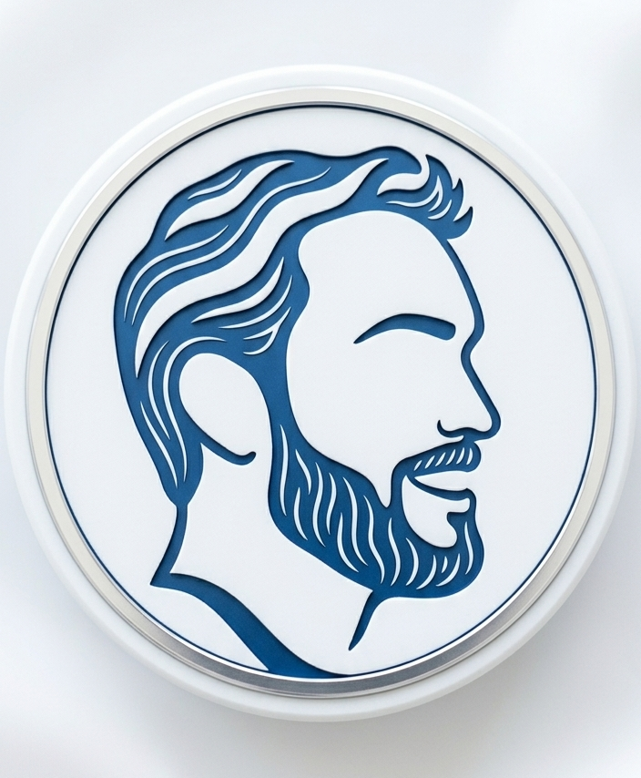

---
title: Conor Thackston
layout: basic
---

    

<h1 style="font-weight: 700; letter-spacing: -0.02em; line-height: 1.1; margin-bottom: 1.5rem;">
  Innovation. 
  Guided by Pedagogy.
</h1>

  Bridging the gap between complex digital tools and meaningful learning outcomes.

  <!-- Card 1: Leadership -->
  <a href="portfolio/Instructional-Technology-Portfolio" style="text-decoration: none; color: inherit; background: #f5f5f7; border-radius: 28px; overflow: hidden; display: flex; flex-col; transition: transform 0.3s ease;">
    

      
      

        <h2 style="font-size: 2rem; font-weight: 700; margin: 0; color: #1d1d1f;">Strategic Leadership</h2>
        
Instructional Tech & Standards Hub →

      

    

  </a>

  <!-- Card 2: Vision -->
  <a href="about/About-Me" style="text-decoration: none; color: inherit; background: #f5f5f7; border-radius: 28px; overflow: hidden; display: flex; flex-col; transition: transform 0.3s ease;">
    

      
      

        <h2 style="font-size: 2rem; font-weight: 700; margin: 0; color: #1d1d1f;">Insights & Vision</h2>
        
Philosophy, Blog & Reflections →

      

    

  </a>

---

  <a href="https://www.canva.com/design/DAFx7XiQI7l/qvCjyHRtr0BQzbEueUIMsQ/view" style="color: #0066cc; text-decoration: none;">Resume</a>
  <a href="https://www.linkedin.com/in/conor-thackston-3912a8127" style="color: #0066cc; text-decoration: none;">LinkedIn</a>
  <a href="mailto:conorthackston@icloud.com" style="color: #0066cc; text-decoration: none;">Email</a>

